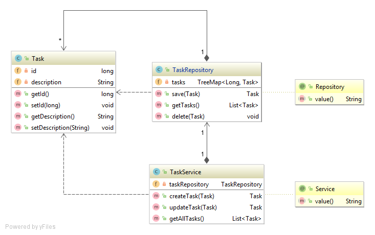

# DigiPR Spring Boot Example

This example illustrates how Spring Boot can be used to develop a microservice.

#### Contents:
- [Application Bootstrapping](#application-bootstrapping)
- [Microservice Application](#microservice-application)
- [Business and Data Layers](#business-and-data-layers)
  - [In-Memory Repository](#in-memory-repository)
- [Test Component](#test-component)
- [Spring Boot Testing](#spring-boot-testing)
- [Static HTML Files and Controllers](#static-html-files-and-controllers)

## Application Bootstrapping

This exemplary application is relying on [Spring Boot](https://projects.spring.io/spring-boot), which is the convention-over-configuration solution of the [Spring](https://spring.io) framework for creating stand-alone, production-grade Applications that you can "just run". In detail the application is based on the following:

- [Spring Boot](https://projects.spring.io/spring-boot)
- [Spring Web](https://docs.spring.io/spring/docs/current/spring-framework-reference/web.html)

Please use the Spring Initializr to bootstrap the application with [this shared configuration](https://start.spring.io/#!type=maven-project&language=java&platformVersion=2.3.4.RELEASE&packaging=jar&jvmVersion=1.8&groupId=rocks.process.acrm&artifactId=digipr-acrm-core&name=digipr-acrm-core&description=demo%20project%20for%20spring%20boot&packageName=rocks.process.acrm&dependencies=web).

Download the ZIP-file and extract it somewhere. Then import the project into your favourite Java/Maven IDE such as IntelliJ, NetBeans or Eclipse.

## Microservice Application

You may change the `PORT` of your microservice using the `src/main/java/resources/application.yml` (you may have to convert it) file by adding the following:

```yml
server:
  port: 8080
```

## Business and Data Layers

Create the following three classes in the corresponding packages as a demonstrating example:



- `Task`, placed under `rocks.process.acrm.data.domain`, can be seen as a value object and minimal domain model.
- `TaskRepository`, placed under `rocks.process.acrm.data.repository`, should be implemented as an in-memory `@Repository` managing `tasks`.
- `TaskService`, placed under `rocks.process.acrm.business.service`, should be implemented as a business `@Service`. The `TaskRepository` should be `@Autowired`.

### In-Memory Repository

Since we do not use a database in this basic example, we develop a minimal in-memory `@Repository` using a `TreeMap`. 

`TreeMap` provides a key/index that is ordered and additionally provides a function `lastKey()` that gives us the possibility to mimic the basic functionality of a repository.

Create a `@Repository` class called `TaskRepository` as follows:

```Java
package rocks.process.acrm.data.repository;
//...
@Repository
public class TaskRepository {
    private TreeMap<Long, Task> tasks = new TreeMap<>();

    public Task save(Task task) {
        long key;
        if (task.getId() == 0) {
            if (tasks.isEmpty()) {
                key = 1;
            } else {
                key = tasks.lastKey() + 1;
            }
            task.setId(key);
        } else {
            key = task.getId();
        }
        tasks.put(key, task);
        return task;
    }

    public List<Task> getTasks() {
        return new ArrayList<>(tasks.values());
    }

    public void delete(Task task){
        tasks.remove(task.getId());
    }
}
```

## Test Component

Create a testing `@Component` class called `TestComponent` as follows:

```Java
package rocks.process.acrm.business;
//...
@Component
public class TestComponent {

    private Logger logger = LoggerFactory.getLogger(TestComponent.class);

    @Autowired
    TaskService taskService;

    @PostConstruct
    public void init(){
        logger.info("=> Create a first task");
        Task task = new Task();
        task.setDescription("first task");
        task = taskService.createTask(task);
        logger.info("=> First task with ID " + task.getId() + " created.");
        logger.info("=> Update the first task");
        task.setDescription("updated first task");
        task = taskService.updateTask(task);
        logger.info("=> First task with ID " + task.getId() + " updated.");
        logger.info("=> Create a second task");
        task = new Task();
        task.setDescription("second task");
        task = taskService.createTask(task);
        logger.info("=> Second task with ID " + task.getId() + " created.");
        logger.info("=> Get a list of all tasks");
        List<Task> tasks = taskService.getAllTasks();
        for(Task taskEntry : tasks){
            logger.info("=> We have \"" + taskEntry.getDescription() + "\" with ID " + taskEntry.getId() + " in the list.");
        }
    }
}
```

## Spring Boot Testing

Write a `@SpringBootTest` as follows:

```Java
@SpringBootTest
class DigiprAcrmCoreApplicationTests {

	@Autowired
	TaskService taskService;

	@Test
	void taskServiceTest() {
		Task task = new Task();
		task.setDescription("third task");
		task = taskService.createTask(task);
		assertThat(task.getId()).isEqualTo(3);

		task.setDescription("updated third task");
		task = taskService.updateTask(task);
		assertThat(task.getDescription()).isEqualTo("updated third task");

		task = new Task();
		task.setDescription("forth task");
		task = taskService.createTask(task);
		assertThat(task.getId()).isEqualTo(4);
	}
}
```

## Static HTML Files and Controllers

Create two basic HTML files under `src\main\resources\static`.

And finally, serve these two HTML files by implementing an `IndexController` as follows:
```Java
package rocks.process.acrm.controller;
//...
@Controller
@RequestMapping(path = "/")
public class IndexController {

    @GetMapping
    public String getIndex(){
        return "index.html";
    }

    @GetMapping(path = "/hello")
    public String getHello(){
        return "hello.html";
    }
}
```
