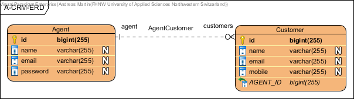
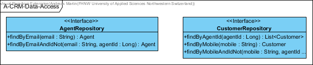
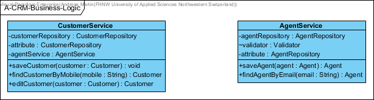

# DigiPR Spring Boot Data Example

This example illustrates how JPA can be used with the help of Spring Boot Data JPA including H2.

#### Contents:
- [Analysis](#analysis)
	- [Scenario](#scenario)
	- [Use Case](#use-case)
- [Application Bootstrapping](#application-bootstrapping)
- [Microservice Application](#microservice-application)
- [Data Access / Persistence Layer](#data-access--persistence-layer)
	- [Domain Objects / Entities](#domain-objects--entities)
	- [Repositories](#repositories)
- [Business Layer](#business-layer)
- [Spring Boot Application and Demo Data](#spring-boot-application-and-demo-data)

## Analysis

### Scenario

A-CRM (Agency Customer-Relationship-Management) is the smallest possible and lightweight demonstration tool that allows agents to manage their customer data. Agents have an own access to their customer data.

### Use Case


## Application Bootstrapping

This exemplary application is relying on [Spring Boot](https://projects.spring.io/spring-boot), which is the convention-over-configuration solution of the [Spring](https://spring.io) framework for creating stand-alone, production-grade Applications that you can "just run". In detail the application is based on the following:

- [Spring Boot](https://projects.spring.io/spring-boot)
- [Spring Web](https://docs.spring.io/spring/docs/current/spring-framework-reference/web.html)
- [Spring Data](https://projects.spring.io/spring-data)
- [Java Persistence API (JPA)](http://www.oracle.com/technetwork/java/javaee/tech/persistence-jsp-140049.html)
- [H2 Database Engine](https://www.h2database.com)

Please use the Spring Initializr to bootstrap the application with [this shared configuration](https://start.spring.io/#!type=maven-project&language=java&platformVersion=2.3.4.RELEASE&packaging=jar&jvmVersion=1.8&groupId=rocks.process.acrm&artifactId=digipr-acrm-data&name=digipr-acrm-data&description=demo%20project%20for%20spring%20boot&packageName=rocks.process.acrm&dependencies=data-jpa,web,h2,validation).

Download the ZIP-file and extract it somewhere. Then import the project into your favourite Java/Maven IDE such as IntelliJ, NetBeans or Eclipse.

## Microservice Application

You may change the `PORT` and other database specific properties of the microservice using the `src/main/java/resources/application.yml` (you may have to convert it) file by adding the following:

```yml
server:
  port: 8080
spring:
  h2:
    console:
      enabled: true
      path: /console
  datasource:
    url: jdbc:h2:file:./data/database
    username: sa
    password: sa
```
## Data Access / Persistence Layer

The data access / persistence layer is implemented using [Java Persistence API (JPA)](http://www.oracle.com/technetwork/java/javaee/tech/persistence-jsp-140049.html) and [Spring Data](https://projects.spring.io/spring-data).

### Domain Objects / Entities

The [Java Persistence API (JPA)](http://www.oracle.com/technetwork/java/javaee/tech/persistence-jsp-140049.html) is providing the following annotations to realize object relational mapping (ORM):

- `@Entity` tells the entity / ORM framework to consider this class as an entity.
- `@Id` defines an attribute to be a primary key that will be automatically generated by using `@GeneratedValue`.
- `@OneToMany` defines an attribute that represents one-to-many or `@OneToOne` for one-to-one entity relationships, which is maybe `mappedBy` the bi-directional relationship indicted by `@ManyToOne` respectively `@OneToOne`.
- `@Temporal(TemporalType.TIMESTAMP)` defines a temporal attribute, which is in this case of type timestamp.
- `@JsonIgnore` is used to prevent JSON serialisation in relationships.

Create the `rocks.process.acrm.data.domain` package and in this package the following domain objects / entities including getters and setters:


The entity beans will then generate the following ERD:



### Repositories

[Spring Data](https://projects.spring.io/spring-data) is providing the following interface, annotations and methods to access the data in CRUD (create, read, update and delete) style:
- `JpaRepository` provides JPA related methods such as CRUD functions.
- `@Repository` tells spring data that it will auto-generate the implementation based on class name provided.
- `@Param` is used before the method param to create a named parameter.
- `findBy...` defines a query from the provided method name extension.

Create the `rocks.process.acrm.data.repository` package and in this package the following repository interfaces:



## Business Layer

Create the `rocks.process.acrm.business.service` package and in this package the following business services:



Implement the `saveCustomer()` and `saveAgent` business logic in a way that the same person will only be stored once in the repository.

## Spring Boot Application and Demo Data

Extend the `@SpringBootApplication` with a `@PostConstruct` method for creating demonstration data:

```java
@SpringBootApplication
public class DigiprAcrmDataApplication {
	
	@Autowired
	private AgentService agentService;
	
	@Autowired
	private CustomerService customerService;

	public static void main(String[] args) {
		SpringApplication.run(DigiprAcrmDataApplication.class, args);
	}
	
	@PostConstruct
	private void initDemoData() throws Exception {
		Agent agent = new Agent();
		agent.setName("Hans Müller");
		agent.setEmail("hans@mueller.ch");
		agent = agentService.saveAgent(agent);
		Customer customer = new Customer();
		customer.setName("Lisa Meyer");
		customer.setMobile("+41794567896");
		customer.setAgent(agent);
		customerService.editCustomer(customer);
	}
}
```

Run your Spring Boot application and access the H2 console using your web-browser: [http://localhost:8080/console](http://localhost:8080/console).